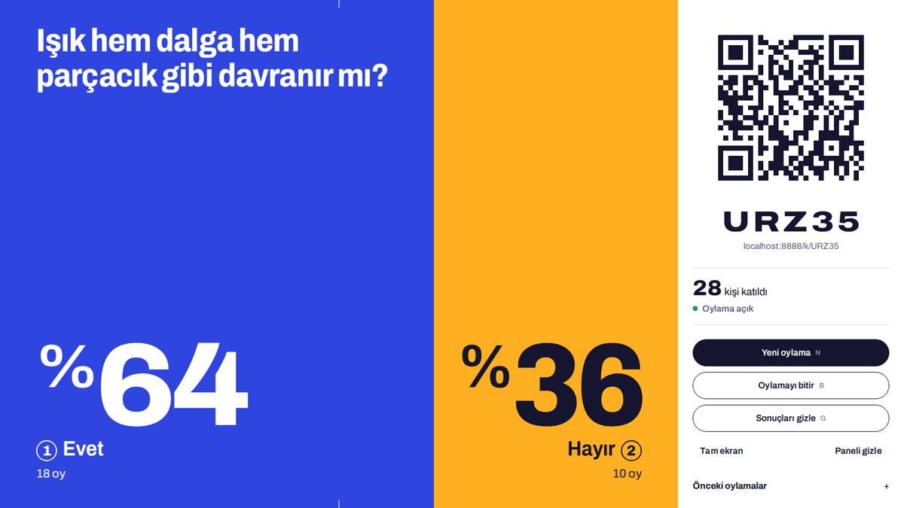
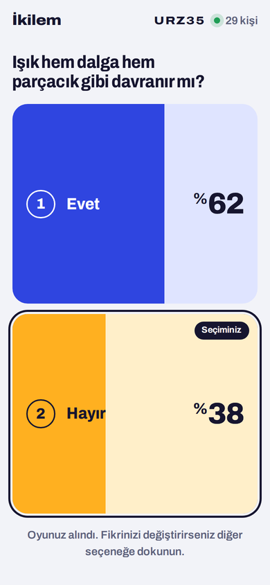

# İkilem

Sınıf içi iki seçenekli canlı oylama. Öğretmen ekranı tahtaya yansıtılır. Öğrenciler karekodu okutup telefonlarından 1 ya da 2'ye dokunur. Oranlar ve katılımcı sayısı hem tahtada hem telefonlarda anında güncellenir.

- **Tek depo, tek servis.** GitHub + Netlify yeterlidir; ayrı veritabanı hesabı gerekmez (Netlify Blobs kullanılır).
- **Derleme yok.** `public/` olduğu gibi yayınlanır, `netlify/functions/` sunucusuz fonksiyon olur.
- **Hesap/üyelik yok.** Öğrenciler ad vermez; her telefon rastgele bir cihaz kimliğiyle tek oy sayılır.





---

## Yayına alma (10 dakika)

1. Bu klasörü yeni bir GitHub deposuna yükleyin (`node_modules` hariç; `.gitignore` bunu zaten dışlar).
2. [app.netlify.com](https://app.netlify.com) → **Add new project → Import an existing project → GitHub** → depoyu seçin.
3. Ayarlar `netlify.toml` dosyasından otomatik okunur; hiçbir alanı değiştirmeden **Deploy** deyin.
4. Yayın bitince `https://<proje-adi>.netlify.app/ogretmen/` adresini tahtada açın.

Netlify Blobs için ek bir ayar ya da ortam değişkeni gerekmez. İsterseniz **Project configuration → Domain management** bölümünden kısa ve akılda kalan bir alt alan adı seçin; karekod da kısalır ve uzaktan daha kolay okunur.

## Yerelde deneme

```bash
npm install
node test/yerel-sunucu.mjs          # http://localhost:8888
# ya da Netlify CLI ile:  npx netlify dev
```

`test/yerel-sunucu.mjs`, Netlify'ın kendi yerel Blobs sunucusunu başlatır ve fonksiyonları gerçek dağıtımdaki yollarla çalıştırır. Aynı ağdaki telefonlarla denemek için tarayıcıda `localhost` yerine bilgisayarın yerel IP adresini kullanın (karekod adresi ona göre oluşur).

### Yük ve doğruluk testi

```bash
node test/yerel-sunucu.mjs &
node test/yuk-testi.mjs http://localhost:8888 300
```

Test; yüzlerce kişinin aynı anda oy vermesini, fikir değiştirmesini, aynı telefondan iki seçeneğe neredeyse aynı anda dokunulmasını, gizli modu, yetkisiz yönetim denemesini ve kapalı oylamayı dener, sayımın birebir doğruluğunu denetler. Yayındaki siteyi de test edebilirsiniz: `node test/yuk-testi.mjs https://<proje>.netlify.app 100` (her çalıştırma yeni bir oturum açar).

---

## Kullanım

**Öğretmen** `/ogretmen/` adresini açar. Oturum kodu ve karekod otomatik oluşur; tarayıcı kapanıp açılsa da aynı oturum sürer.

| Denetim | Kısayol | Ne yapar |
|---|---|---|
| Yeni oylama | N | Soru ve iki seçeneği yazın (hazır seçenekler var). Mevcut sonuçlar "Önceki oylamalar"a kaydedilir, sayaç sıfırlanır; öğrenci ekranları kendiliğinden yeni soruya geçer. |
| Oylamayı bitir / yeniden aç | B | Bitince yeni oy kabul edilmez, öğrenciler kesin sonucu görür. |
| Sonuçları gizle / göster | G | Gizliyken yalnızca oy sayısı görünür (sürü etkisini önlemek için). Göster'e basınca sonuçlar animasyonla açılır. |
| Tam ekran | F | Yansıtma için. |
| Paneli gizle / göster | P | Sonuçlar tüm ekranı kaplar, köşede küçük karekod kalır. |
| CSV olarak indir | | Tüm turların sonuçları; Türkçe Excel'de doğrudan açılır. |
| Yeni kodla baştan başla | | Yeni katılım kodu üretir (öğrenciler yeni karekodu okutur). |

**Öğrenci** karekodu okutur ya da ana sayfaya kodu yazar. Dokunduğu anda oy verilir ve düğmeler canlı yüzde çubuklarına dönüşür. Oylama açıkken diğer seçeneğe dokunarak fikrini değiştirebilir; yine tek oy sayılır.

---

## Mimari

```
public/
  index.html              giriş (kodla katıl / oylama başlat)
  ogretmen/index.html     öğretmen ekranı
  k/index.html            öğrenci ekranı  (/k/KOD adresine yönlendirilir)
  assets/css, js, fonts, vendor/qrcode.js
netlify/
  functions/oturum.mjs    POST /api/oturum          yeni oturum
  functions/durum.mjs     GET  /api/durum/:kod      öğrenci durumu (CDN'de 1 sn önbellek)
                          GET  /api/canli/:kod      öğretmen durumu (jeton ister)
  functions/oy.mjs        POST /api/oy              oy ver / değiştir
  functions/yonet.mjs     POST /api/yonet           yeni tur, bitir/aç, gizle/göster
  lib/ortak.mjs           veri modeli ve yardımcılar
test/                     yerel sunucu ve yük testi (dağıtıma girmez)
```

**Canlılık.** Netlify kalıcı bağlantı (WebSocket) sunmadığı için ekranlar uyarlanır aralıklarla sorar: öğretmen ekranı saniyede bir, öğrenciler 1,5–4 saniyede bir (değişiklik oldukça sıklaşır, sakin dönemde seyrekleşir; sekme arka plandayken durur). Oy veren kişi kendi oyunu beklemeden görür.

**Doğru sayım.** Netlify Blobs'ta ortak bir sayacı artırmak eşzamanlı yazmalarda oy kaybettirir. Bu yüzden her oy kendi anahtarına yazılır (`s/KOD/r/TUR/CIHAZ/ZAMAN-SECIM`) ve sayım listeden yapılır; her cihazın yalnızca en yeni oyu geçerlidir. Yazmalar birbirini ezemez.

**Ölçek.** Öğrenci durum yanıtları Netlify CDN'de 1 saniye önbelleklenir ve aynı fonksiyon örneğine gelen eşzamanlı istekler tek okumayı paylaşır; sınıf ne kadar kalabalık olursa olsun depo saniyede yaklaşık bir kez okunur. Oy isteği tüm listeyi saymaz, yalnızca kendi kaydını yazar.

**Güvenlik.** Yönetim işlemleri, oturum açılırken yalnızca öğretmen tarayıcısına verilen rastgele bir jeton ister (sunucuda özeti saklanır). Gizli modda öğrencilere sayılar hiç gönderilmez. Kullanıcı metinleri sunucuda temizlenir, istemcide yalnızca `textContent` ile basılır.

## Maliyet (Netlify ücretsiz plan)

Kredi temelli planlarda ücretsiz hesap ayda 300 kredi alır; istekler 10.000 başına 2 kredi, fonksiyon işlemi GB-saat başına 10 kredi, her üretim yayını 15 kredidir. Kaba tahminle 40 öğrencilik 45 dakikalık bir ders **6–14 kredi** harcar. Güncel tarifeyi Netlify panelinizden kontrol edin.

## Bilinen sınırlar

- Aynı telefonda gizli sekme ya da farklı tarayıcıyla ikinci oy verilebilir. Okulda tüm cihazlar çoğunlukla aynı IP'yi paylaştığı için IP sınırı konmamıştır.
- Güncellemeler en fazla 1–2 saniye gecikmeli görünebilir (CDN önbelleği ve yoklama aralığı).
- Eski oturumlar depoda kalır; Netlify panelindeki **Blobs** bölümünden `ikilem` deposunu temizleyebilirsiniz.

## Özelleştirme

Renkler `public/assets/css/ikilem.css` dosyasının başındaki `:root` değişkenlerindedir (`--bir`, `--iki`, `--murekkep` …). Mavi–kehribar çifti renk körlüğünde de ayırt edilebilir; ayrıca her yerde 1 ve 2 numaraları yazar, renk tek başına bilgi taşımaz.

## Lisanslar

- Archivo yazı tipi: SIL Open Font License 1.1 (`public/assets/fonts/OFL.txt`)
- qrcode-generator (Kazuhiko Arase): MIT, lisans başlığı `public/assets/vendor/qrcode.js` içinde
